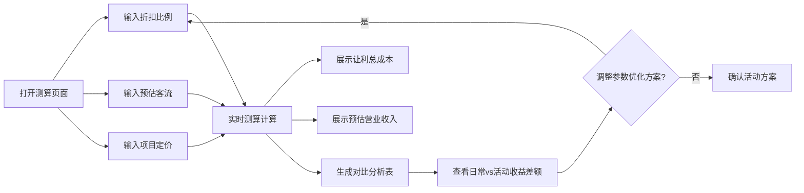

## 1. 产品概述
线下手作门店周末主题活动让利成本预估工具，为门店工作人员提供快速测算活动收益的可视化工具。通过输入折扣比例、预估客流、项目定价等核心参数，自动计算让利成本与营业收入，并生成对比分析表格。

- 核心价值：帮助门店快速评估活动方案的盈利可行性，优化折扣力度与预期收益的平衡
- 目标用户：门店店长、活动策划人员、运营管理人员

## 2. 核心特征

### 2.1 用户角色
| 角色 | 注册方式 | 核心权限 |
|------|----------|----------|
| 门店工作人员 | 无需注册，本地使用 | 填写测算参数、查看计算结果、调整参数对比不同方案 |

### 2.2 功能模块
1. **参数配置面板**：折扣比例滑块、预估客流输入、项目平均定价输入
2. **实时测算结果**：让利总成本、预估总营业收入、毛利率
3. **对比分析表格**：日常营业与活动期间的收益差额对比
4. **数据可视化**：营收对比柱状图、成本构成饼图

### 2.3 页面详情
| 页面名称 | 模块名称 | 功能描述 |
|-----------|-------------|---------------------|
| 测算主页 | 标题区域 | 展示工具名称、门店标识、当前日期 |
| 测算主页 | 参数配置面板 | 三组核心参数的输入控件，支持实时调整 |
| 测算主页 | 测算结果卡片 | 展示让利总成本、预估营收、毛利率等核心指标 |
| 测算主页 | 对比分析表格 | 并排展示日常营业与活动期间的各项数据差额 |
| 测算主页 | 可视化图表 | 柱状图与饼图直观展示收益对比与成本构成 |

## 3. 核心流程
用户打开工具页面 → 填写/调整三项核心参数 → 系统实时计算并更新所有测算数据 → 用户查看对比表格分析收益差额 → 调整参数优化方案 → 确认最终活动方案

## 4. 用户界面设计

### 4.1 设计风格
- **主色调**：暖陶土色 (#D97757) 作为主色，搭配米白色背景 (#FAF7F2)，体现手作的温暖质感
- **辅助色**：深棕色 (#3E2C24) 用于文字，苔藓绿 (#6B8E23) 用于正向指标，赭石红 (#B45309) 用于成本提示
- **按钮风格**：圆润的胶囊形按钮，带有轻微的木质纹理投影，悬停时有上浮效果
- **字体**：标题使用 "Noto Serif SC" 衬线体体现手作温度，正文使用 "Noto Sans SC" 保证可读性
- **布局风格**：卡片式布局，使用柔和的阴影和圆角，各区块有明确的分隔线和层次感
- **装饰元素**：微妙的纸张纹理背景、手绘风格的分隔线、手作工具图标点缀

### 4.2 页面设计概览
| 页面名称 | 模块名称 | UI元素 |
|-----------|-------------|-------------|
| 测算主页 | 标题区域 | 大标题"周末主题活动让利成本预估"，副标题显示门店名称和日期，暖棕色标题配米色背景 |
| 测算主页 | 参数配置面板 | 三张并排的参数卡片，每张卡片包含图标、标题、数值输入框/滑块、单位说明 |
| 测算主页 | 测算结果卡片 | 三张核心指标卡片，分别展示让利成本、预估营收、毛利率，使用不同背景色区分 |
| 测算主页 | 对比分析表格 | 双色对比表格，左列日常营业（灰色调），右列活动期间（暖色调），差额用颜色标注正负 |
| 测算主页 | 可视化图表 | 左侧柱状图对比日常与活动的营收/成本，右侧饼图展示成本构成 |

### 4.3 响应式设计
- 桌面端（>1024px）：三栏布局，参数面板在左，结果在右，图表在下
- 平板端（768px-1024px）：两栏布局，参数面板在上，结果在下
- 移动端（<768px）：单列堆叠布局，所有模块垂直排列，优化触控交互

### 4.4 交互动效
- 页面加载时各卡片有淡入上滑的交错动画（animation-delay 递增）
- 参数调整时结果数值有滚动变化的数字动画
- 对比表格数据更新时有高亮闪烁提示
- 鼠标悬停在卡片上时有轻微上浮和阴影加深效果
