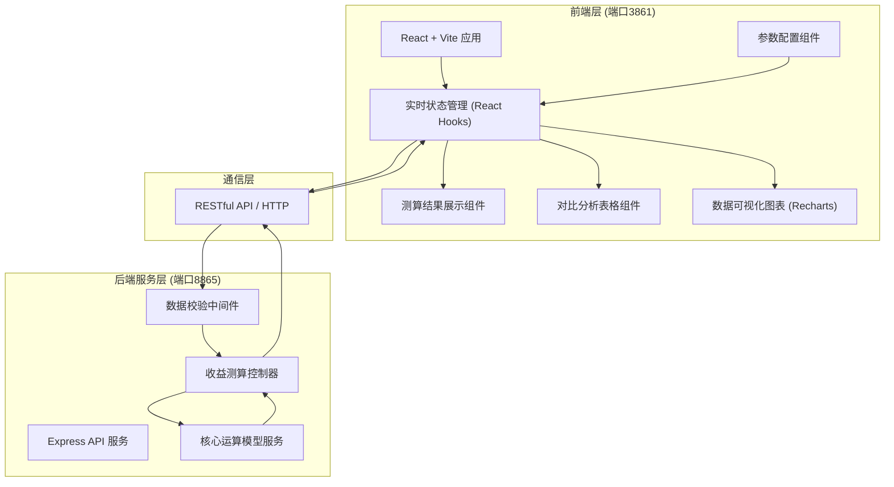
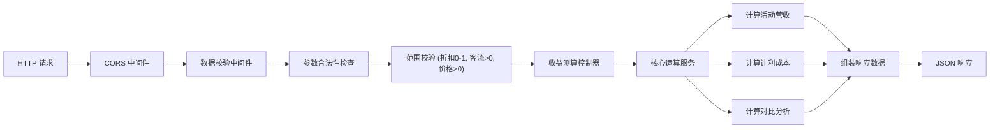

## 1. 架构设计



## 2. 技术说明

- **前端**：React@18 + TypeScript + TailwindCSS@3 + Vite@5 + Recharts@2
- **前端端口**：3861
- **后端**：Node.js + Express@4 + TypeScript
- **后端端口**：8865
- **数据传输**：RESTful API + JSON
- **初始化工具**：npm create vite@latest
- **构建工具**：Vite
- **数据库**：无（纯内存实时计算，不存储数据）

### 核心运算模型
- 日常营业收入 = 项目定价 × 日常客流
- 活动营业收入 = 项目定价 × 折扣比例 × 活动预估客流
- 让利总成本 = (项目定价 - 项目定价 × 折扣比例) × 活动预估客流
- 收益差额 = 活动营业收入 - 日常营业收入 - 额外成本
- 毛利率 = (营业收入 - 物料成本) / 营业收入 × 100%

## 3. 路由定义

| 路由 | 用途 |
|-------|---------|
| / | 测算主页，包含全部功能模块 |
| /api/calculate | POST 测算接口，接收参数返回计算结果 |
| /api/health | GET 健康检查接口 |

## 4. API 定义

### 4.1 测算请求接口

**TypeScript 类型定义：**

```typescript
// 请求参数
interface CalculateRequest {
  discountRate: number;      // 折扣比例 (0-1之间，如0.8表示8折)
  estimatedFlow: number;     // 预估单日到店体验客流 (正整数)
  avgPrice: number;          // 店内手作项目平均定价 (正数)
  dailyFlow?: number;        // 日常客流 (可选，默认50)
  materialCostRate?: number; // 物料成本率 (可选，默认0.3)
}

// 响应结果
interface CalculateResponse {
  // 活动期间数据
  activity: {
    revenue: number;         // 预估总营业收入
    discountCost: number;    // 让利总成本
    profit: number;          // 预估毛利
    grossMargin: number;     // 毛利率 (%)
  };
  // 日常营业数据
  daily: {
    revenue: number;         // 日常营业收入
    profit: number;          // 日常毛利
    grossMargin: number;     // 日常毛利率 (%)
  };
  // 对比分析
  comparison: {
    revenueDiff: number;     // 营收差额
    profitDiff: number;      // 利润差额
    revenueChangeRate: number; // 营收变化率 (%)
    profitChangeRate: number;  // 利润变化率 (%)
  };
  // 明细数据（用于图表）
  breakdown: {
    labels: string[];
    activityData: number[];
    dailyData: number[];
  };
}
```

### 4.2 接口详情

| 方法 | 路径 | 描述 |
|------|------|------|
| POST | /api/calculate | 提交测算参数，返回完整测算结果 |
| GET | /api/health | 服务健康检查，返回状态信息 |

### 4.3 请求示例

```json
{
  "discountRate": 0.8,
  "estimatedFlow": 80,
  "avgPrice": 128,
  "dailyFlow": 50,
  "materialCostRate": 0.3
}
```

### 4.4 响应示例

```json
{
  "activity": {
    "revenue": 8192,
    "discountCost": 2048,
    "profit": 5734.4,
    "grossMargin": 70
  },
  "daily": {
    "revenue": 6400,
    "profit": 4480,
    "grossMargin": 70
  },
  "comparison": {
    "revenueDiff": 1792,
    "profitDiff": 1254.4,
    "revenueChangeRate": 28,
    "profitChangeRate": 28
  },
  "breakdown": {
    "labels": ["营业收入", "让利成本", "物料成本", "毛利"],
    "activityData": [8192, 2048, 2457.6, 5734.4],
    "dailyData": [6400, 0, 1920, 4480]
  }
}
```

## 5. 服务端架构图



## 6. 项目目录结构

```
├── frontend/                # 前端项目 (端口3861)
│   ├── src/
│   │   ├── components/      # 组件目录
│   │   │   ├── ParameterPanel.tsx    # 参数配置面板
│   │   │   ├── ResultCards.tsx       # 测算结果卡片
│   │   │   ├── ComparisonTable.tsx   # 对比分析表格
│   │   │   └── DataCharts.tsx        # 数据可视化图表
│   │   ├── hooks/           # 自定义Hooks
│   │   │   └── useCalculator.ts      # 测算逻辑Hook
│   │   ├── types/           # TypeScript类型定义
│   │   │   └── index.ts
│   │   ├── utils/           # 工具函数
│   │   │   └── format.ts            # 格式化工具
│   │   ├── App.tsx
│   │   ├── main.tsx
│   │   └── index.css
│   ├── package.json
│   ├── vite.config.ts
│   └── tailwind.config.js
│
└── backend/                 # 后端项目 (端口8865)
    ├── src/
    │   ├── controllers/     # 控制器
    │   │   └── calculator.controller.ts
    │   ├── services/        # 服务层
    │   │   └── calculator.service.ts
    │   ├── middleware/      # 中间件
    │   │   └── validator.middleware.ts
    │   ├── types/           # 类型定义
    │   │   └── index.ts
    │   └── server.ts        # 服务入口
    ├── package.json
    └── tsconfig.json
```

## 7. 启动配置

- 前端开发启动：`npm run dev -- --port 3861`
- 后端开发启动：`npm run dev -- --port 8865`
- 前端构建：`npm run build`
- 后端构建：`npm run build`
- API 基础地址：`http://localhost:8865/api`
